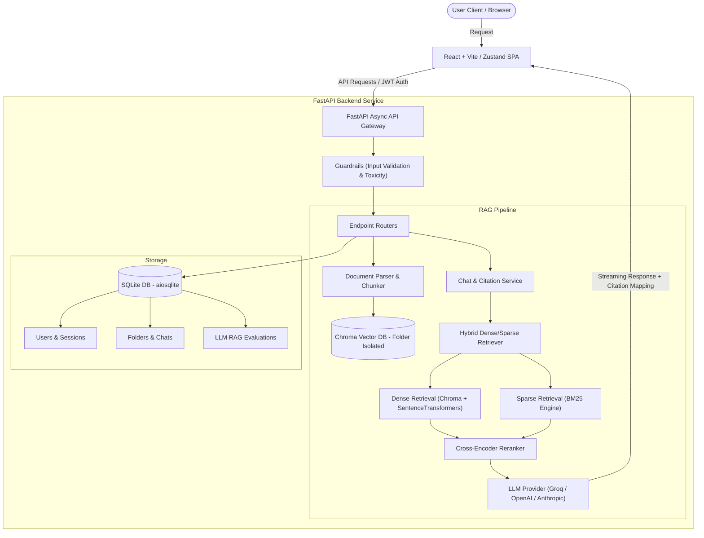

# 🧠 Knowledge Hub AI

<p align="center">
  
  
  
  
  
  
</p>

**Knowledge Hub AI** is a premium, enterprise-ready, multi-tenant AI Knowledge Management Platform. It empowers teams and individuals to establish secure folders/workspaces, upload rich documents, and converse with isolated knowledge bases using a high-fidelity Retrieval-Augmented Generation (RAG) pipeline.

Built to run with low-latency and maximum resource efficiency, the platform utilizes a streamlined **single-mode architecture**: SQLite for transactional state, local in-process ThreadPool workers for document chunking, SentenceTransformers for fast local embeddings, and ChromaDB for vector storage.

---

## 📖 Table of Contents

- [✨ Features](#-features)
- [🏗️ System Architecture](#️-system-architecture)
- [🛠️ Technology Stack](#️-technology-stack)
- [📂 Folder Structure](#-folder-structure)
- [🚀 Quick Start & Local Setup](#-quick-start--local-setup)
- [🐳 Running with Docker](#-running-with-docker)
- [⚙️ Configuration Reference (.env)](#️-configuration-reference-env)
- [📊 RAG Pipeline Architecture Deep Dive](#-rag-pipeline-architecture-deep-dive)
- [🤗 Deploying to Hugging Face Spaces](#-deploying-to-hugging-face-spaces)
- [🛠️ Troubleshooting](#️-troubleshooting)
- [🤝 Contributing](#-contributing)
- [📄 License](#-license)

---

## ✨ Features

* 📁 **Isolated Workspaces (Folders)**: Keep knowledge bases completely segmented. Each folder acts as its own secure, standalone collection.
* 🤖 **Precision Multi-Tenant RAG**: Retrieve text grounded *only* in the current workspace's documents to prevent cross-tenant hallucinations.
* ⚡ **Ultra-Fast Inference**: Native support for Groq (default), OpenAI, Anthropic, and Hugging Face Hub inference endpoints.
* 💬 **Streaming Chat & Citation Memory**: Follow-up questions, persistent chat history, and precise character-matched citation mapping back to sources.
* 🔒 **Premium Authentication & Google OAuth**: Standard JWT credentials alongside secure Google single sign-on.
* 📊 **Lightweight Custom Observability & Evaluation**: Real-time DB metrics, timeline volume, latency tracking, and LLM-as-a-Judge RAG evaluation (Faithfulness, Precision, Relevancy).
* 🎨 **Breathtaking Design & UX/UI**: Immersive dark mode, custom violet glassmorphic panels, shimmering loading states, responsive dashboard charts, and elegant micro-animations.

---

## 🏗️ System Architecture

The workflow below illustrates how incoming queries are sanitized, processed, merged through the hybrid retriever, and compiled with citation memory before streaming back to the client.



---

## 🛠️ Technology Stack

### Frontend (SPA Client)
* **Framework**: React.js 18 + Vite (TypeScript)
* **Routing**: React Router v6
* **State Management**: Zustand
* **Styling**: Vanilla CSS (TailwindCSS framework classes, HSL custom palettes, Glassmorphic panels, keyframe animations)
* **Data Visualization**: Recharts (Interactive usage and system health metrics)

### Backend (Robust API)
* **Framework**: FastAPI (Asynchronous Python 3.10)
* **ORM / Database**: SQLAlchemy (Async queries with SQLite `aiosqlite` adapter)
* **Vector Store**: ChromaDB (Folder-isolated collections)
* **Embeddings**: SentenceTransformers `all-MiniLM-L6-v2` (Fast, standard size, optimized CPU footprint)
* **RAG Retrieval**: Hybrid retrieval (Dense Chroma Vector Retrieval + Sparse BM25 + Cross-Encoder reranking)
* **Security**: JWT tokens, bcrypt hash validation, CORS policies, client-IP rate-limiting.
* **Safety Guardrails**: Input injection detection & toxic content filtering.

---

## 📂 Folder Structure

```text
├── backend/
│   ├── app/
│   │   ├── api/                 # Endpoint routers (v1 auth, folders, docs, chat, analytics)
│   │   ├── core/                # Middleware, custom exceptions, JWT security
│   │   ├── db/                  # Base engines, models (user, folder, document, messages, evaluations)
│   │   ├── evaluation/          # LLM-as-a-Judge custom RAG metric evaluator
│   │   ├── guardrails/          # Safety guards (injection, toxicity filters)
│   │   ├── llm/                 # Standard LLM providers (Groq, OpenAI, Anthropic, HF)
│   │   ├── memory/              # Chat histories (SQLite transient backing)
│   │   ├── observability/       # Structured logs writer (JSON Lines tracing)
│   │   ├── rag/                 # Parser, chunker, embeddings, retriever, citation-extractor
│   │   ├── schemas/             # Pydantic schemas (Request/Response validation models)
│   │   ├── services/            # Main services orchestrators (RAG pipeline, auth, docs)
│   │   ├── workers/             # Local in-process tasks queues (ThreadPool tasks)
│   │   └── main.py              # FastAPI main entrypoint and static SPA hosting setup
│   └── requirements.txt         # Core Python dependencies
├── frontend/
│   ├── src/
│   │   ├── pages/               # Views (Auth, Layout, Dashboard, FolderView, Analytics, Settings)
│   │   ├── stores/              # Zustand app state and auth storage
│   │   ├── App.tsx              # Application shell & routes setup
│   │   └── main.tsx             # Entry hook
│   ├── index.html               # SPA main skeleton
│   ├── vite.config.ts           # Compiles frontend directly into backend/static for production
│   └── package.json             # Node dependencies and build directives
├── Dockerfile                   # Multi-stage production container instructions
├── .env.example                 # Configured variables layout
└── README.md                    # This project README
```

---

## 🚀 Quick Start & Local Setup

### Step 1: Clone and Set Up Environment
1. Clone this repository to your machine.
2. In the root directory, create a `.env` file from the template:
   ```bash
   cp .env.example .env
   ```
3. Open `.env` and fill in your variables (at least `SECRET_KEY` and one LLM API key, e.g., `GROQ_API_KEY`).

### Step 2: Start the Backend (Python)
1. Navigate to the backend directory and set up a virtual environment:
   ```bash
   cd backend
   python -m venv venv
   source venv/bin/activate  # On Windows use: venv\Scripts\activate
   ```
2. Install Python packages:
   ```bash
   pip install -r requirements.txt
   ```
3. Run the FastAPI development server:
   ```bash
   python -m uvicorn app.main:app --host 0.0.0.0 --port 7860 --reload
   ```

### Step 3: Start the Frontend (React.js)
1. Open a new terminal in the frontend directory:
   ```bash
   cd frontend
   npm install
   ```
2. Start the development server (configured to proxy API requests to `http://localhost:7860`):
   ```bash
   npm run dev
   ```
3. Open your browser and navigate to `http://localhost:5173`.

---

## 🐳 Running with Docker

You can package and run the entire unified React + FastAPI application in a single command using Docker:

```bash
# Build the Docker image
docker build -t knowledge-hub-ai .

# Run the container mapping port 7860
docker run -p 7860:7860 --env-file .env knowledge-hub-ai
```

Once running, navigate to `http://localhost:7860` to access the full application.

---

## ⚙️ Configuration Reference (.env)

Below are the variables supported in the system configuration:

| Variable | Type | Default | Description |
| :--- | :--- | :--- | :--- |
| `APP_NAME` | String | `"Knowledge Hub AI"` | The name of the application. |
| `APP_VERSION` | String | `"1.0.0"` | The semantic version of the deployment. |
| `DEBUG` | Boolean | `True` | Enables interactive debugging and detailed logs. |
| `SECRET_KEY` | String | *Required* | Secret key used for signing JWT access tokens. |
| `DATABASE_URL` | String | `sqlite+aiosqlite:///...` | SQLite database URI backing the persistent state. |
| `RATE_LIMIT_PER_MINUTE` | Integer | `60` | Max API operations permitted per client IP per minute. |
| `DEFAULT_LLM_PROVIDER` | String | `"groq"` | The default active provider (`groq`, `openai`, `anthropic`, `hf`). |
| `GROQ_API_KEY` | String | `""` | API key for Groq inference. |
| `OPENAI_API_KEY` | String | `""` | API key for OpenAI GPT models. |
| `ANTHROPIC_API_KEY`| String | `""` | API key for Anthropic Claude models. |
| `HF_API_TOKEN` | String | `""` | API token for Hugging Face Hub. |

---

## 📊 RAG Pipeline Architecture Deep Dive

The ingestion and retrieval mechanics are tailored for high context retention and citation accuracy:

1. **Document Ingestion**: Custom parsers (`parser.py`) extract raw text from PDF, DOCX, CSV, TXT, and MD files. Documents are segmented using hierarchical token recursive chunking (`chunker.py`) to prevent loss of context across block boundaries.
2. **Dense Vector Store**: Embeddings are computed locally using Hugging Face's lightweight `SentenceTransformers(all-MiniLM-L6-v2)`. Vector indexes are persisted locally inside folder-isolated collections in ChromaDB.
3. **Sparse & Hybrid Reranking**: Queries undergo conversational rewrite (resolving pronoun co-references using LLM history), followed by hybrid retrieval. This combines dense Chroma cosine scoring with sparse BM25 token frequencies, which are then re-scored using a lightweight cross-encoder model to return highly relevant chunks.
4. **Citations Engine**: Exact character-matched substrings are extracted from source snippets during generation, delivering grounded source references side-by-side with chat lines.

---

## 🤗 Deploying to Hugging Face Spaces (FREE)

Because the app is built on local SQLite databases and in-process ThreadPool pipelines, you can run this entire application inside a single free container space:

1. Create a new Space on [Hugging Face Spaces](https://huggingface.co/spaces).
2. Choose **Docker** as the SDK/Template, and select the **Blank** template.
3. In your Space's **Settings**, add the following **Repository Secrets**:
   * `SECRET_KEY` (Any long, random security string)
   * `GROQ_API_KEY` (Your free Groq API key)
4. Upload all project files (including `Dockerfile`, `backend/`, and `frontend/`) into your Space repository.
5. Hugging Face will automatically detect the `Dockerfile`, compile the React frontend bundle, spin up the FastAPI server, and host the application completely for free!

---

## 🛠️ Troubleshooting

#### 1. SQLite Database Lock Errors
* **Cause**: Multi-threaded write access to SQLite databases can occasionally cause write-locks.
* **Solution**: Ensure your connection URI uses the async adapter (`sqlite+aiosqlite:///...`). Alternatively, append query arguments like `?timeout=30` to the URL.

#### 2. Vector DB Schema Mismatch or Chunker Failures
* **Cause**: Changing chunk sizes or embedding models in `.env` without clearing old databases.
* **Solution**: Delete the database directories generated inside `backend/data/` or delete the target collections to force a fresh index compilation.

#### 3. CORS Policies or Frontend Port Clashes
* **Cause**: Navigating to incorrect ports or launching uvicorn on a non-proxied port.
* **Solution**: Ensure that your frontend is run using `npm run dev` (running on port `5173`) and that Vite's proxy rule in `vite.config.ts` points correctly to uvicorn (`http://localhost:7860`).

---

## 🤝 Contributing

Contributions are welcome! Please follow these guidelines:
1. Fork the project repository.
2. Create your feature branch (`git checkout -b feature/AmazingFeature`).
3. Commit your changes (`git commit -m 'Add some AmazingFeature'`).
4. Push to the branch (`git push origin feature/AmazingFeature`).
5. Open a Pull Request.

---

## 📄 License

Distributed under the MIT License. See [LICENSE](LICENSE) for more information.
